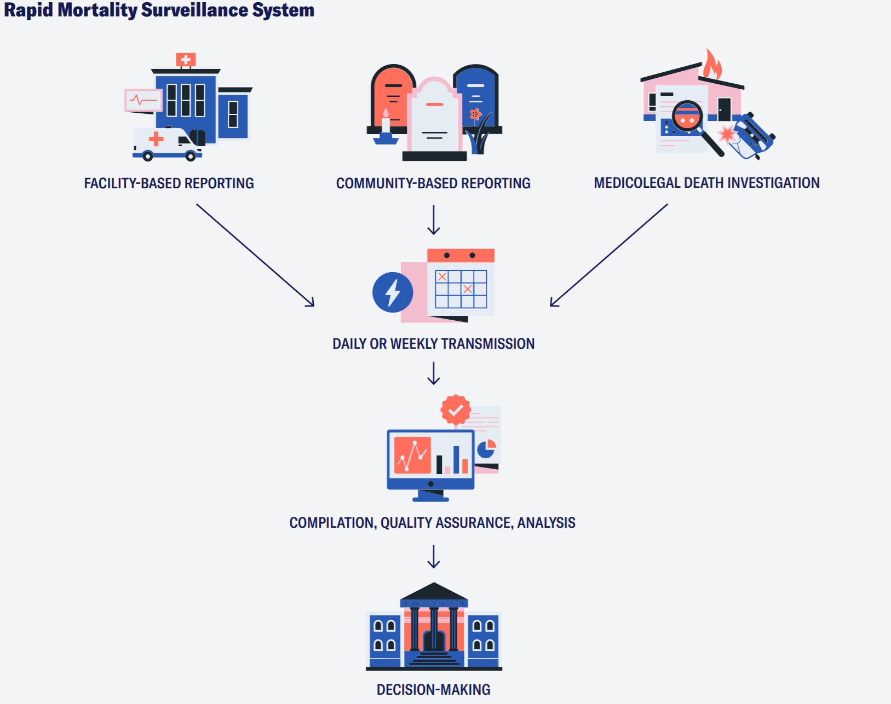
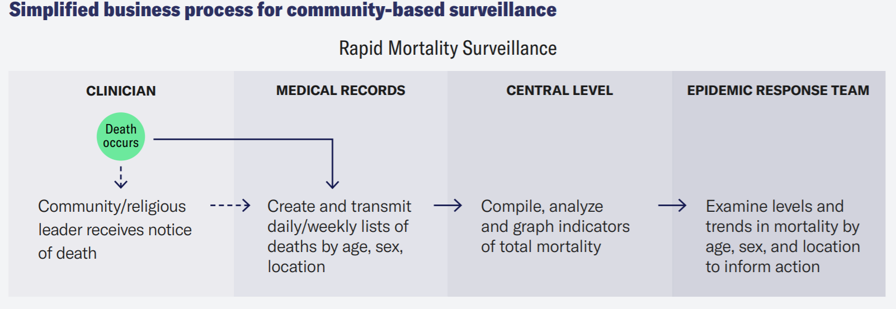

# RMS - Rapid Mortality Surveillance System Design { #rms-event-design }
## Introduction

While the number of COVID-19 deaths is a key indicator for measuring the impact of the pandemic across the world, this metric is not easy to collect in all contexts. Rapid mortality surveillance (RMS) is a system for generating daily or weekly counts of deaths mortality by age, sex, date of death, place of death, and place of usual residence (WHO, 2020). Combined with pre-pandemic data on mortality, RMS enables countries to calculate excess deaths during an epidemic, defined as the degree to which currently measured mortality exceeds historically established levels.

The purpose of this package is to provide practical guidance and a core set of metadata to implement rapid mortality surveillance in national DHIS2-based health information systems. This package is aligned to the [WHO's Technical Package for Rapid Mortality Surveillance and Epidemic Response](https://www.who.int/publications/i/item/revealing-the-toll-of-covid-19) (2020) for assessing the toll of COVID-19 in countries.  It is designed to be flexible and feasible for use in low-resource settings, including contexts where data collection largely remains paper-based.

Reporting of total mortality from facilities, communities and midolegal personnel (as appropriate to country context) with basic data such as age, sex, date of death, place of death and place of residence enables a more complete picture of impact, particularly for deaths that may occur in the home/the community or may be indirectly linked to COVID-19. In addition, analyses of year-over year trends pre- and post-epidemic can reveal indirect impact related to disruptions in access to health services and products. 

## System Design Overview

### Use case summary

According to the WHO's technical package, RMS requires 1) a source of rapidly and routinely reported deaths by age, sex and location; and 2) some means to establish a baseline of pre-epidemic mortality levels by age and sex against which to compare the current reports. The metadata package corresponds to these components with an event program for line-listed data collection of deaths optimized for facility and community reporting; and a reference dashboard that enables year-over-year trend analysis to examine excess deaths compared to pre-pandemic levels. 

Unlike cause-based mortality surveillance systems and death certification systems, the intent of RMS is to capture *total* mortality for the purpose of epidemic impact monitoring. Data are intended to be collected both in the facility and in the community, to capture all deaths. This approach can overcome known shortfalls to achieving completeness and coverage of cause-based mortality systems in many countries, such as poor linkages between health facility death reporting and national CRVS systems as well as high proportions of deaths that occur in the community and may go unreported. 

For cause-based mortality surveillance, please reference the [DHIS2 Cause of Death metadata package](#cod-design) designed to support the WHO recommended medical certification of cause of death and International Classification of Disease (ICD) standards.

### Intended users

The package is designed with the following end users in mind:

1. Health facility staff responsible for reporting deaths
2. Community-based health workers, volunteers, religious or community leaders who serve as community reporters

3. Medicolegal personnel (i.e. coroners, medical examiners) in countries where a high proportion of deaths are captured by these workers
4. Epidemic response teams, national COVID-19 task forces, and policy makers responsible for analyzing the data and directing epidemic response measures

### Data flow

RMS seeks to pull data from multiple reporting sources to gather a complete picture of total mortality. 

Ideally, the identification and reporting of deaths as part of RMS is also used as a notification for the civil registration system where possible. Careful consideration of existing community-based and facility-based death reporting protocols, completeness and coverage of vital events reporting, and the extent to which cause-based mortality and death certification systems can be sustained at adequate completeness & pace during an epidemic should be considered during the design of national RMS. 

A typical business process for facility-based reporting is as follows: 

## Program configuration 

This package uses the event data model in DHIS2 to record deaths. The event model was selected because: 1) it is flexible enough to report and analyze the key RMS variables age, sex, date of death, place of death, and place of usual residence; 2) data is reported for a given death at single point in time and does not require longitudinal tracking; and 3) no directly personally identifiable data are captured in this program. 

## User groups

## Analytics

### Dashboard

## Resources
